# AWS Infrastructure with Terraform

This project demonstrates how to create AWS infrastructure using Terraform with a **modular design**, **remote state management in S3**, and **state locking with DynamoDB**.

The infrastructure provisions:

- A custom VPC with a public subnet
- Internet Gateway and Route Table
- Security Group for web + SSH traffic
- EC2 instance with key pair authentication
- S3 bucket for Terraform state storage
- DynamoDB table for state locking

---

## 📌 Architecture Diagram

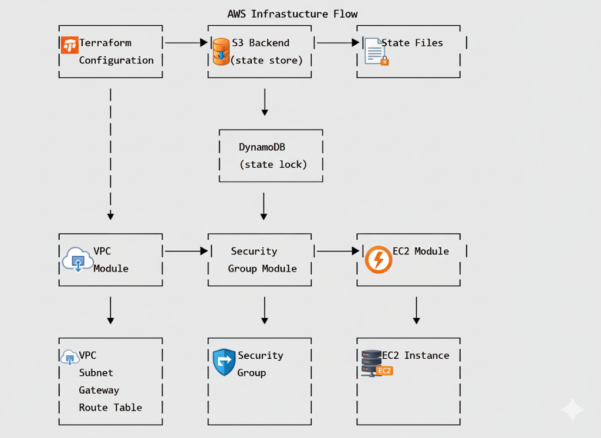

---

## ⚙️ Prerequisites

- Terraform installed  
- AWS CLI installed & configured  
- AWS account with permissions for EC2, VPC, S3, DynamoDB  

---

## 1️⃣ Create a Custom VPC

We created a custom VPC with a public subnet.  

- Internet Gateway attached for internet access  
- Route Table configured to route traffic from subnet to the internet  

**Screenshots:**  
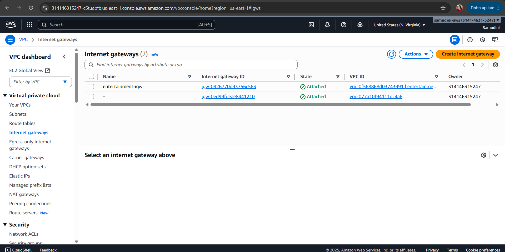  
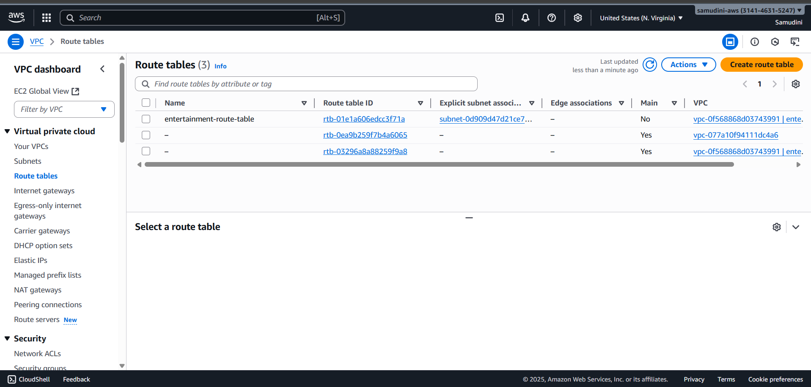  

**Information:**  
The VPC allows isolation and control over network traffic. Public subnet ensures EC2 instances have internet access.

---

## 2️⃣ Create a Security Group

Security Group created to control inbound/outbound traffic:

- **Inbound:** HTTP (80) & SSH (22) open to all IPs  
- **Outbound:** All traffic allowed  

**Screenshot:**  
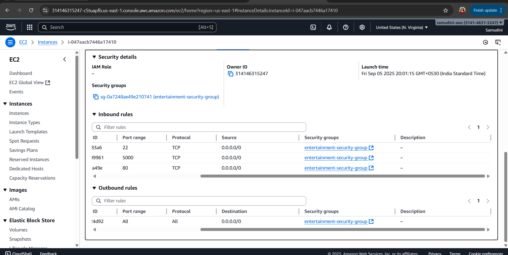  

**Information:**  
Security groups act as a virtual firewall. Opening only required ports ensures security.

---

## 3️⃣ Launch an EC2 Instance

- EC2 instance launched inside the public subnet  
- Key pair used for SSH access  
- Security group attached for web and SSH access  

**Screenshot:**  
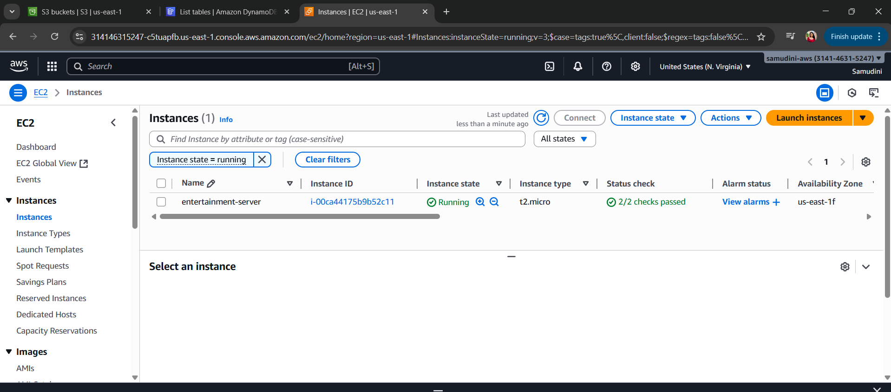  

**Information:**  
EC2 provides scalable compute resources. Key pair ensures secure password-less access.

---

## 4️⃣ Create S3 Bucket for Terraform State

- S3 bucket created to store Terraform state files remotely  
- Versioning enabled to track changes over time  

**Screenshots:**  
  
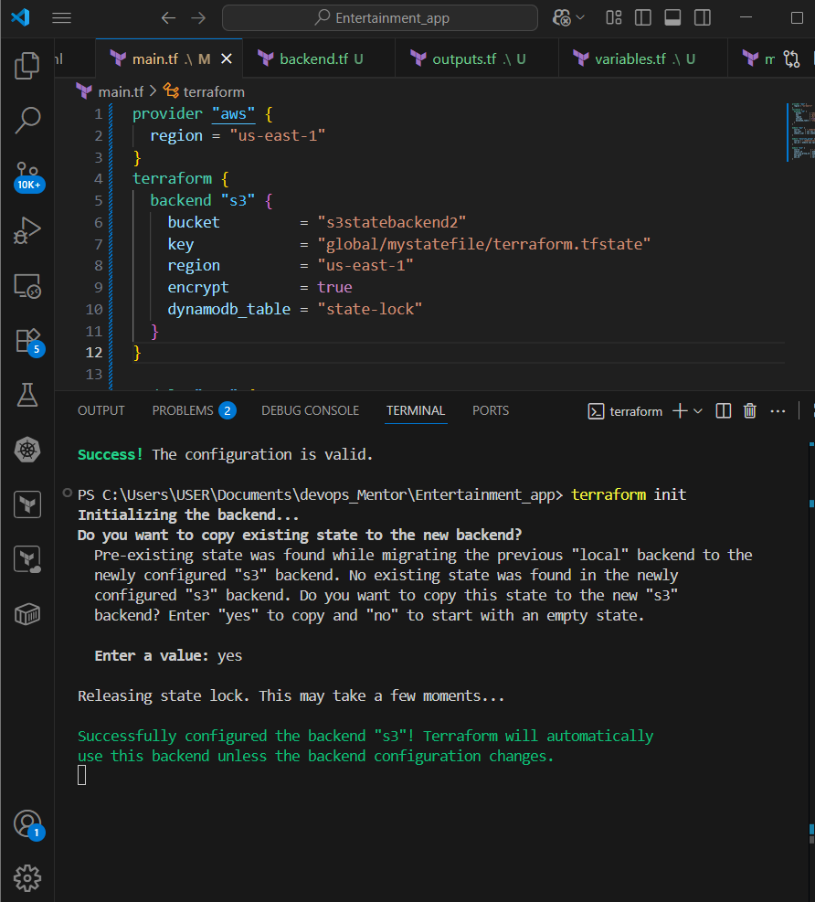  

**Information:**  
Remote state in S3 centralizes infrastructure info, avoids conflicts, and keeps the repo clean.

---

## 5️⃣ Create DynamoDB Table for State Locking

- DynamoDB table manages state locking  
- Ensures only one person modifies infrastructure at a time  

**Screenshots:**  
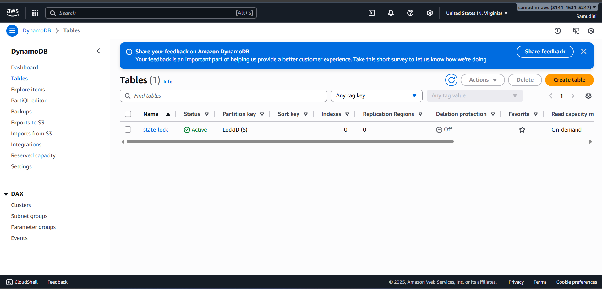  
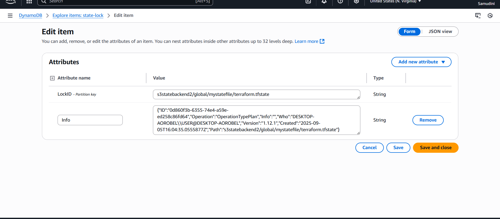  

**Information:**  
State locking prevents simultaneous Terraform runs from corrupting state.

---

## 6️⃣ Test Locking and Unlocking

**Lock Test:**  
Open two terminals, run `terraform apply` in one, then `terraform plan` in the other. The second terminal shows a lock error.  

**Unlock:**  
Use `terraform force-unlock <LOCK_ID>` or manually remove lock from DynamoDB.  

**Screenshots:**  
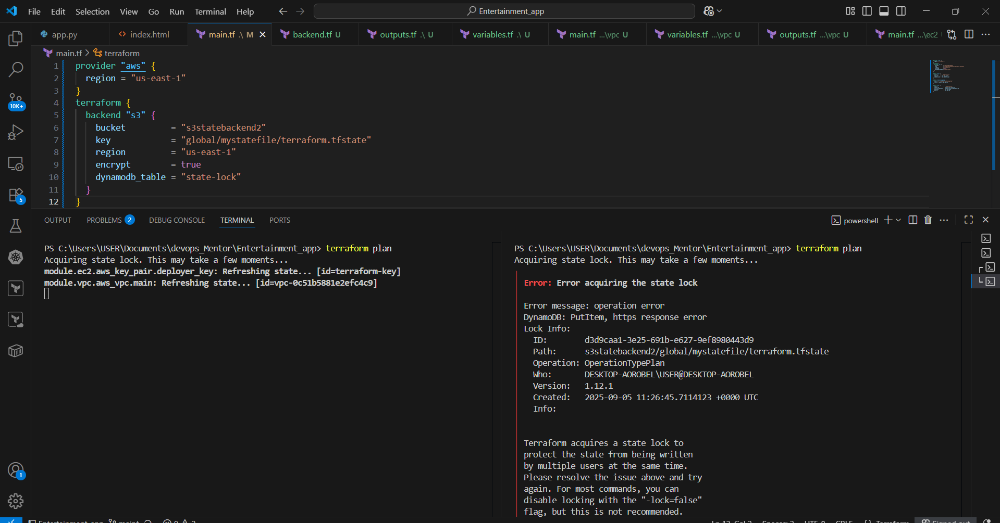  
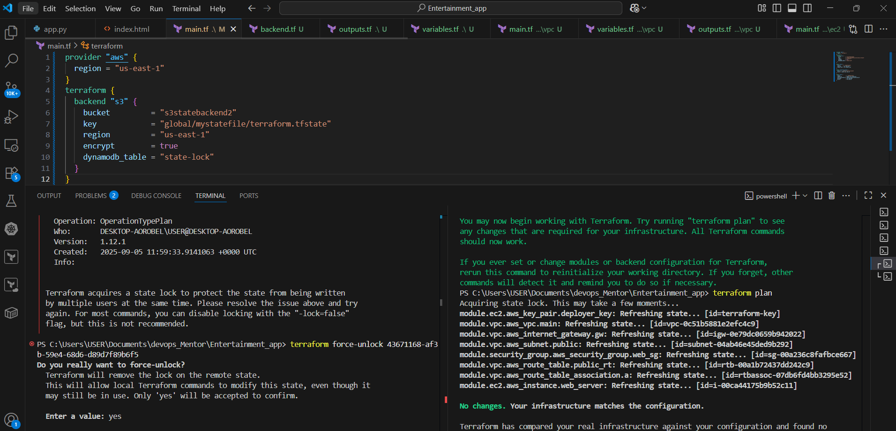  

**Information:**  
Locking ensures consistency and safe collaboration in multi-user environments.

---

## 7️⃣ Why We Don’t Push State Files to GitHub

Terraform state files should **never** be version-controlled:

- 🔐 Security risk → Contains sensitive info  
- 📦 Large files → Bloats repository  
- ⚔️ Merge conflicts → Multiple commits conflict constantly  
- 🔄 Integrity risk → Remote state ensures a single source of truth  
- 🕒 Better history → S3 versioning provides safer state history  

✅ Instead: Use **S3 backend** + **DynamoDB locks**  

**Screenshot:**  
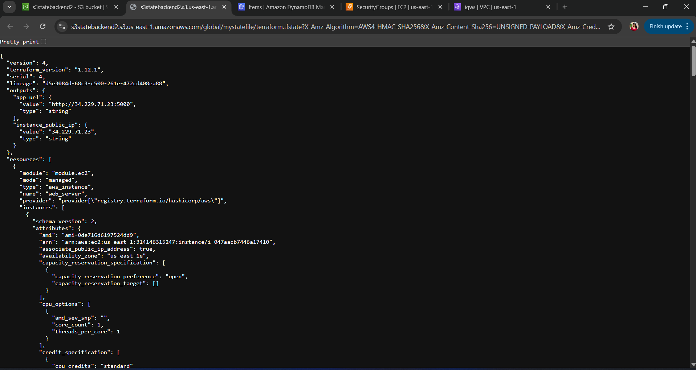  

---

## 🔧 Backend Configuration

`backend.tf`:

```hcl
terraform {
  backend "s3" {
    bucket         = "s3statebackend2"
    key            = "global/mystatefile/terraform.tfstate"
    region         = "us-east-1"
    dynamodb_table = "state-lock"
  }
}

```

## Configure AWS credentials:
```aws configure```

### 📑 Variables (terraform.tfvars)

aws_region       = "us-east-1"
instance_type    = "t2.micro"
ami_id           = "ami-0c55b159cbfafe1f0"  # Amazon Linux 2 AMI
key_name         = "terraform-key"
public_key_path  = "~/.ssh/terraform-key.pub"

### 🚀 Usage

terraform init     # Initialize Terraform
terraform plan     # Preview infrastructure
terraform apply    # Apply changes
terraform destroy  # Destroy resources

###📌 State Management

Why S3 Backend?

-✅ Remote storage accessible by team

-✅ Versioning support for rollback

-✅ High durability and availability

-✅ Secure (encryption at rest)

Why DynamoDB Locking?

-✅ Prevents concurrent operations on state

-✅ Ensures consistency across team members

-✅ Automatically releases locks when done

## 🛠️ Troubleshooting

Check existing locks:

```aws dynamodb scan --table-name state-lock```


Delete corrupted lock:

aws dynamodb delete-item \
  --table-name state-lock \
  --key '{"LockID": {"S": "s3statebackend2/global/mystatefile/terraform.tfstate"}}'

##🤝 Contributing

-Fork the repository

-Create a feature branch

-Make your changes

-Test your changes

-Submit a Pull Request


