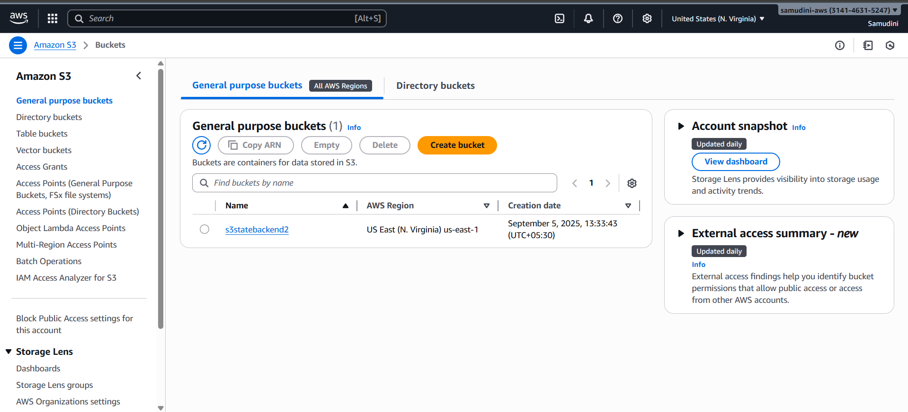

# AWS Infrastructure with Terraform

This project demonstrates how to create AWS infrastructure using Terraform with a **modular design**, **remote state management in S3**, and **state locking with DynamoDB**.

The infrastructure provisions:

- A custom VPC with a public subnet
- Internet Gateway and Route Table
- Security Group for web + SSH traffic
- EC2 instance with key pair authentication
- S3 bucket for Terraform state storage
- DynamoDB table for state locking

---

📌 Architecture Diagram
 

⚙️ Prerequisites

Terraform installed

AWS CLI installed & configured

AWS account with permissions for EC2, VPC, S3, DynamoDB

1️⃣ Create a Custom VPC

We started by creating a custom VPC with a public subnet.

An Internet Gateway was attached to allow internet access.

A Route Table was configured to route traffic from the subnet to the internet.

Screenshot:

 

Information:
The VPC allows us to isolate resources and control network traffic. Public subnet ensures EC2 instances can access the internet.

2️⃣ Create a Security Group

A Security Group was created to control inbound and outbound traffic.

Rules added:

Inbound: HTTP (port 80) and SSH (port 22) open to all IPs

Outbound: All traffic allowed

Screenshot:

Information:
Security groups act as a virtual firewall. By opening only required ports, we maintain security.

3️⃣ Launch an EC2 Instance

An EC2 instance was launched inside the public subnet.

A key pair was used for SSH access.

The security group created earlier was attached to allow web and SSH access.

Screenshot:

Information:
EC2 provides scalable compute resources. Using a key pair ensures secure access without passwords.

4️⃣ Create S3 Bucket for Terraform State

An S3 bucket was created to store Terraform state files remotely.

Bucket versioning was enabled to track changes over time.

Screenshot:

Information:
Storing state in S3 centralizes infrastructure information. This avoids conflicts and keeps the repo clean.

5️⃣ Create DynamoDB Table for State Locking

A DynamoDB table was created to manage state locking.

Ensures only one person modifies infrastructure at a time.

Screenshot:

Information:
State locking prevents simultaneous Terraform runs that could corrupt the state.

6️⃣ Test Locking and Unlocking

Lock Test: Open two terminals and run terraform apply in one, then terraform plan in the other.

The second terminal shows a lock error, proving the locking works.

Screenshot:

Unlock: Use force unlock command in Terraform or remove lock manually in DynamoDB.
 terraform force-unlock <LOCK_ID>

Screenshot:

 

Information:
Locking ensures consistency and safe collaboration in multi-user environments.

7️⃣ Why We Don’t Push State Files to GitHub

Terraform state files should never be version-controlled because:

🔐 Security risk → Contains sensitive info (resource IDs, secrets, credentials)

📦 Large files → Grows over time, bloating repo

⚔️ Merge conflicts → Multiple commits would constantly conflict

🔄 Integrity risk → Remote state ensures one source of truth

🕒 Better history → S3 versioning provides safer state history

✅ Instead → We use S3 backend + DynamoDB locks

Screenshot:

Configure AWS credentials:
aws configure

🔧 Backend Configuration

The backend.tf file configures S3 as the backend for state storage and DynamoDB for state locking:

terraform {
  backend "s3" {
    bucket         = "s3statebackend2"
    key            = "global/mystatefile/terraform.tfstate"
    region         = "us-east-1"
    dynamodb_table = "state-lock"
  }
}
(screenshots/s3-backend-seting.png)

📑 Variables

terraform.tfvars:

aws_region       = "us-east-1"
instance_type    = "t2.micro"
ami_id           = "ami-0c55b159cbfafe1f0"  # Amazon Linux 2 AMI
key_name         = "terraform-key"
public_key_path  = "~/.ssh/terraform-key.pub"

🚀 Usage

terraform init     # Initialize Terraform
terraform plan     # Preview infrastructure
terraform apply    # Apply changes
terraform destroy  # Destroy resources

📌 State Management
Why S3 Backend?

✅ Remote storage accessible by team members

✅ Versioning support for rollback

✅ High durability and availability

✅ Secure (encryption at rest)

Why DynamoDB Locking?

✅ Prevents concurrent operations on state

✅ Ensures consistency across team members

✅ Automatically releases locks when done

🛠️ Troubleshooting
Check existing locks: 
aws dynamodb scan --table-name state-lock

Delete corrupted lock
aws dynamodb delete-item \
  --table-name state-lock \
  --key '{"LockID": {"S": "s3statebackend2/global/mystatefile/terraform.tfstate"}}'

🤝 Contributing

Fork the repository

Create a feature branch

Make your changes

Test your changes

Submit a Pull Request
